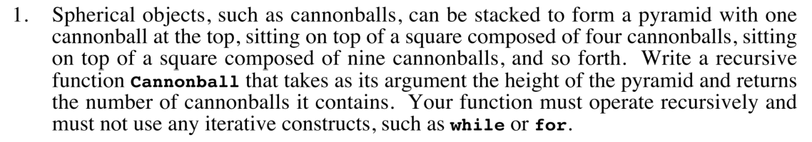
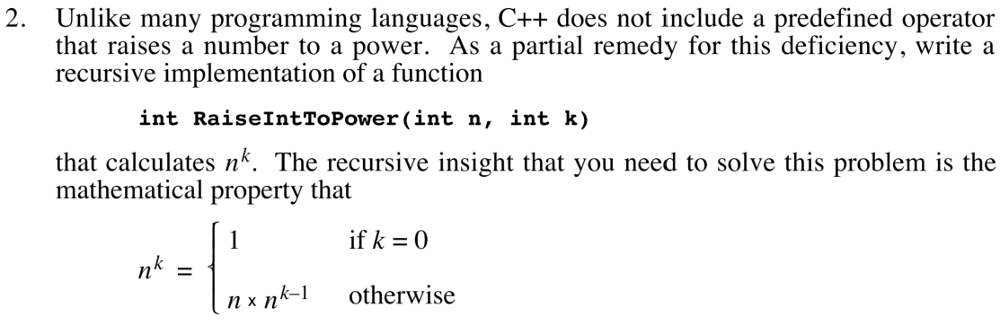
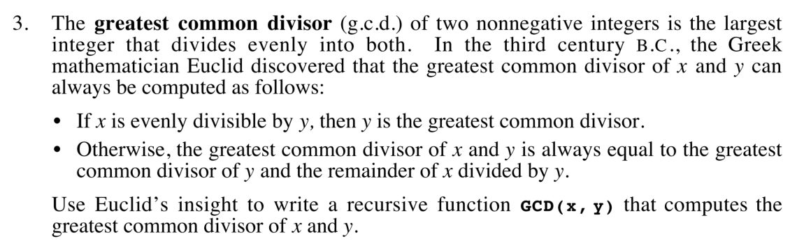
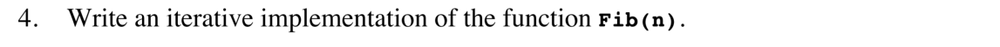
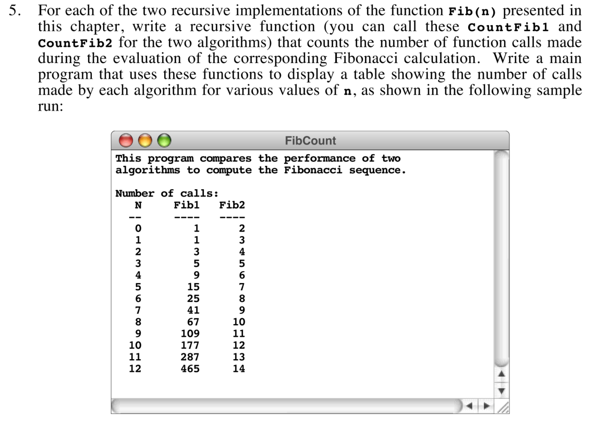
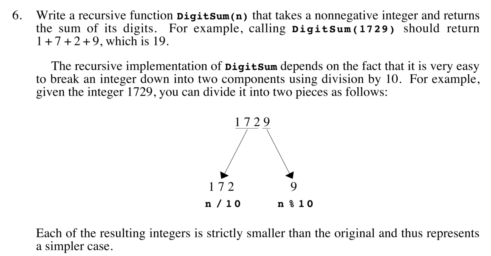
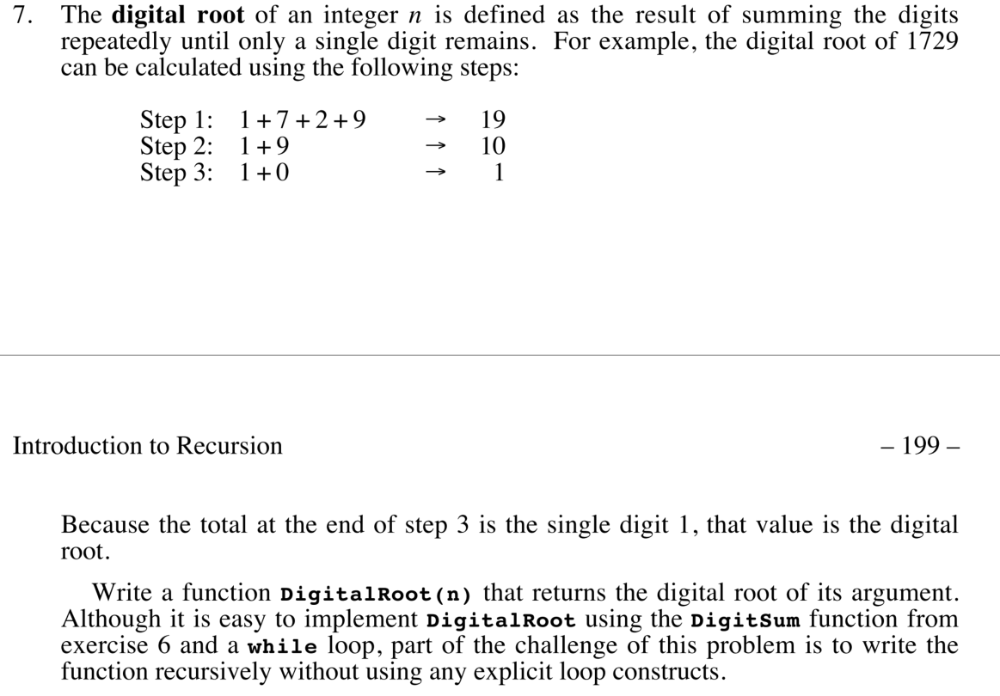
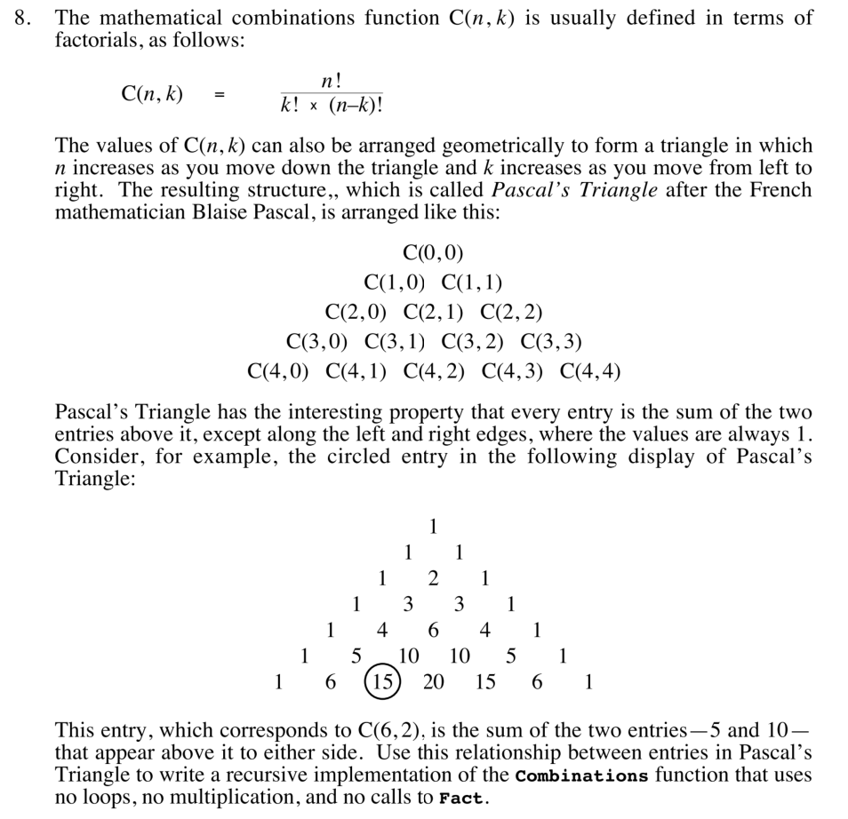
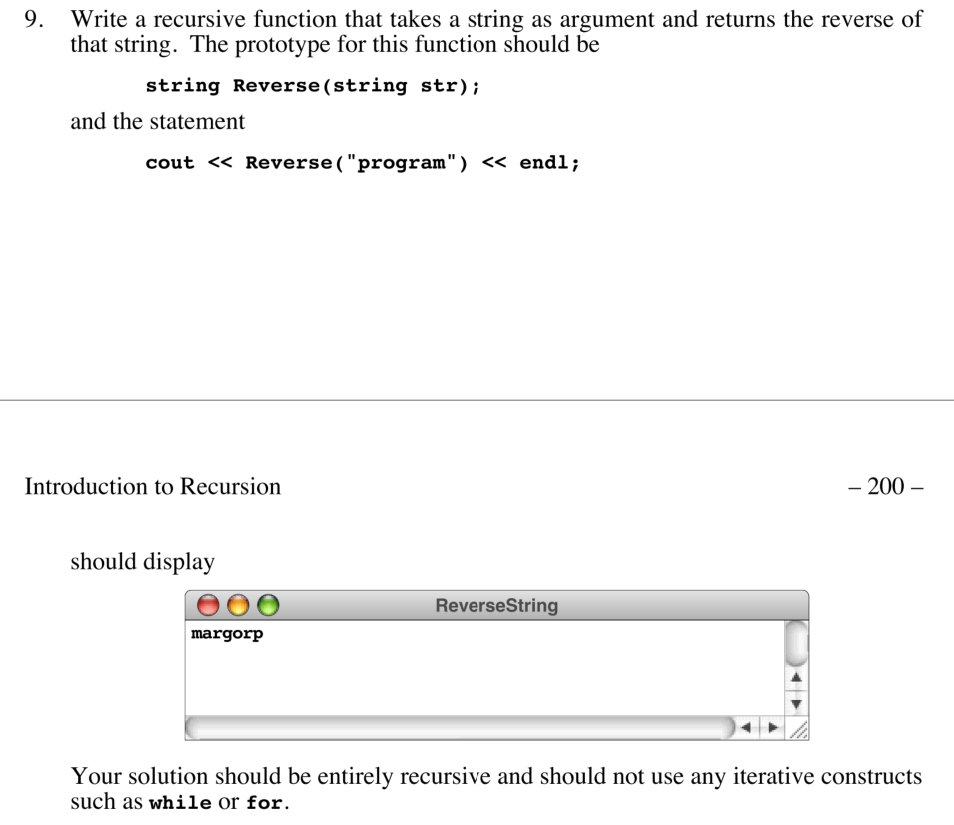
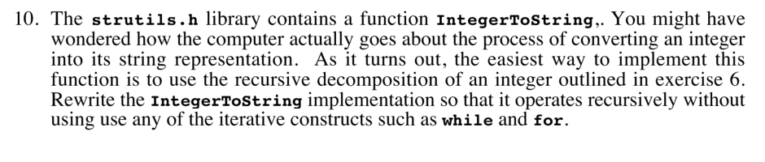

# Chapter 5. Introduction to recursion

## Programming exercises

- [`0501.cpp`](./0501.cpp)

---

- [`0502.cpp`](./0502.cpp)

---

- [`0503.cpp`](./0503.cpp)

---

- [`0504.cpp`](./0504.cpp)

---

---

---

---

---

---

